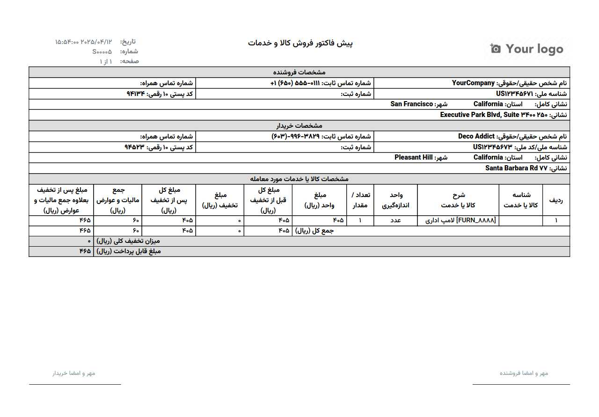
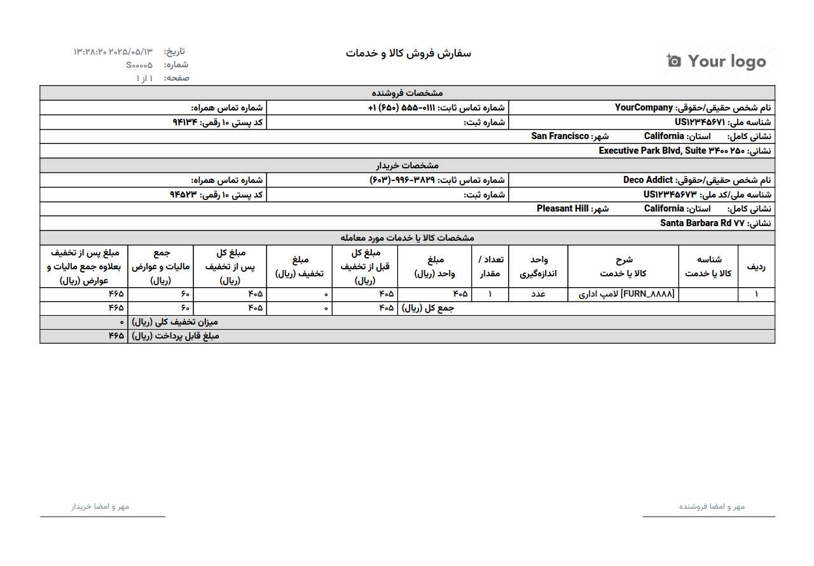
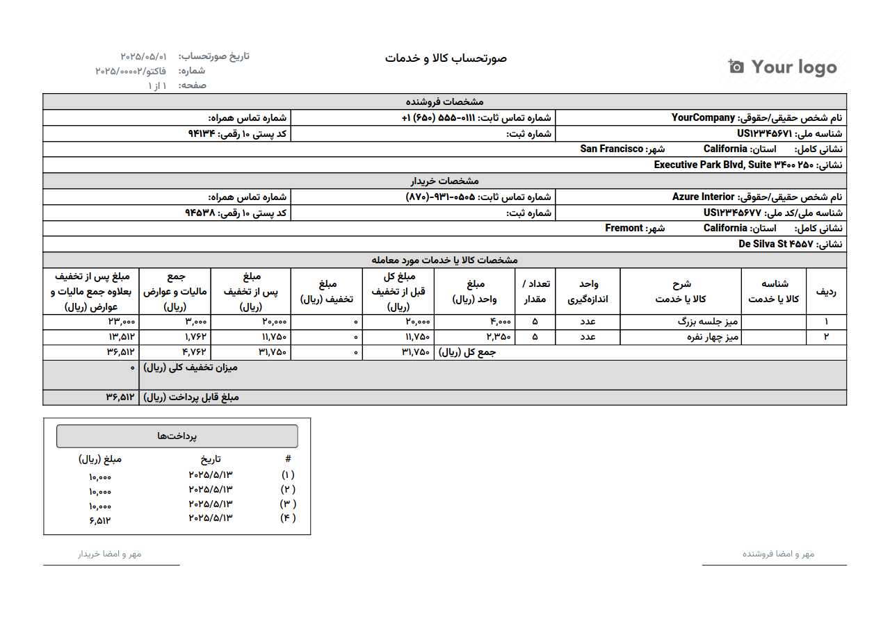

# 📌 معرفی
این ماژول گزارش‌های رسمی و غیر رسمی برای پیش‌فاکتور / سفارش (`sale.order`) و همچنین گزارش رسمی فاکتور (`account.move`)  به سیستم اودو اضافه می‌کند.

# ✨ ویژگی‌های کلیدی
- تولید گزارش فاکتور رسمی 
- گزارش سفارشات / پیش‌فاکتورهای (رسمی و غیررسمی)
- سازگار با نسخه `۱۸.۰` اودو 

# 🛠 نصب
- ماژول را در پوشه `custom_addon` قرار دهید
- در تنظیمات اودو، حالت توسعه‌دهنده را فعال کنید
- به منوی `Apps` → `Update Apps List` بروید
- ماژول را جستجو و نصب کنید

# 🖥 استفاده
پس از نصب:
- به بخش `فروش` → `پیش‌فاکتورها` یا `صدور فاکتور` بروید
- فاکتور مورد نظر را انتخاب کنید
- روی دکمه چاپ کلیک کنید
- گزارش مورد نظر را از لیست انتخاب نمایید

# 🖼 پیش‌نمایش
## پیش فاکتور

## سفارش فروش

## فاکتور بدون نمایش پرداخت

## فاکتور با نمایش پرداخت

👈 در حالت نمایش فاکتور غیر رسمی **مشخصات فروشنده** نمایش داده نمی شود.

# 🤝 مشارکت
مشارکت‌های شما استقبال می‌شود! برای مشارکت:
- ریپوی را فورک کنید
- برنچ جدید ایجاد کنید (`git checkout -b feature/AmazingFeature`)
- تغییرات را کامیت کنید (`git commit -m 'Add some AmazingFeature'`)
- به برنچ اصلی پوش کنید (`git push origin feature/AmazingFeature`)
- یک پول ریکوئست باز کنید

# 📜 مجوز
این پروژه تحت مجوز `LGPLv3` منتشر شده است.

# 📞 پشتیبانی
برای گزارش باگ یا درخواست ویژگی‌های جدید به [صفحه ایشوهای ماژول](https://github.com/odooers-ir/oe_general_reports/issues) مراجعه نمایید.
